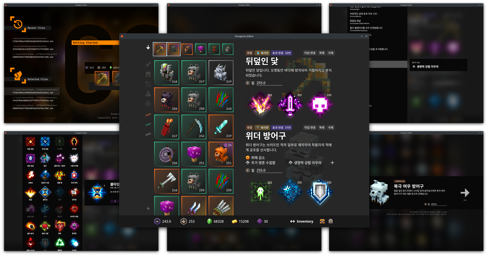

# Minecraft Dungeons Editor

마인크래프트 던전스의 게임 내 저장 데이터를 연구용 목적으로 수정하기 위한 도구입니다.  
지금은 던전스가 윈도우만 공식적으로 지원하지만 리눅스에서도 일부 돌아가는 경우가 있고(Steam) 해서 Windows 및 Linux 를 지원합니다.

툴 내에서 표시되는 모든 이미지 및 문구는 설치된 게임 데이터에서 읽어오며, 따라서 Minecraft Dungeons 가 설치되어있지 않은 기기에서는 사용이 불가능합니다.   



## 코멘트
일단 돌아는(돌아만) 가는 버전입니다.  
최적화고 뭐고 하나도 안했고, 에러 핸들링도 최소한으로 '개발자가 원하는 대로 썼을 경우'에 '확인된 경우'만 핸들링했습니다.  
조만간 재구성 최적화 및 상태와 상태 홀더 정리, 그리고 추가 에러 핸들링같은것들을 해볼 생각입니다.  

이슈 환영!!

## 다운로드 및 설치
Release 섹션에서 운영체제에 맞는 파일을 다운받습니다.
- Linux: DungeonsEditor.AppImage  
  실행파일로, 해당 파일로 바로 실행 가능합니다.
- Windows: DungeonsEditor.zip  
  적절한 위치에 압축을 해제하면, DungeonsEditor.exe 라는 파일을 통해 실행할 수 있습니다.

## 완전히 삭제
- Linux: AppImage 파일을 삭제하고, `~/.dungeons-editor` 디렉터리를 삭제합니다.
- Windows: 압축을 해제했던 디렉터리를 모두 삭제하고, `%HOMEDRIVE%%HOMEPATH$/.dungeons-editor` 를 삭제합니다. (일반적으로 `C:\Users\{{사용자명}}\.dungeons-editor`입니다.)

## 사용
### 파일 열기
1. 툴을 실행하고 리소스 파일을 찾는 과정이 끝날때까지 기다립니다.
    - 만약 이 과정이 시작되지 않고 '게임 데이터를 찾을 수 없습니다' 라는 화면이 표시될 경우 예측 가능한 범위 내에서 게임 파일을 찾지 못한 경우로, 직접 게임 설치 위치를 지정해주셔야합니다.
2. 오른쪽의 회색 화살표를 눌러 편집할 파일을 직접 선택하거나, 왼쪽 아래의 'Detected Files' 영역에 자동으로 찾아진 파일 중 하나를 선택합니다.
    - 직접 파일을 선택  
      파일 탐색 화면이 표시됩니다. UX가 친절한 편이 아니므로, 다른 시스템 탐색기를 통해 경로를 복사하여 붙혀넣으시는 것을 추천합니다.  
      확인을 눌러 선택을 완료하고 에디터로 진입합니다.
    - Detected Files 에서 선택  
      우측 회색 화살표에 미리보기 정보가 표시됩니다. 수정하려는 파일이 맞는지 확인하고, 맞을 경우 회색 화살표를 눌러 에디터로 진입합니다.

### 장비 수정
왼쪽 목록에서 수정할 장비를 선택합니다. 우측에 선택한 장비가 표시됩니다.
- 효과부여
   - 수정할 효과를 클릭하면 상세 화면이 표시됩니다.
   - 상세화면의 좌측 영역에서 적용된 효과를 다른 효과로 변경할 수 있습니다.
   - 상세화면의 좌측 영역에서 이미 적용된 효과를 다시 누르면 해당 슬롯을 잠긴 슬롯으로 변경합니다.
   - 상세화면의 우측 영역에서 효과의 레벨을 변경할 수 있습니다.  
     효과의 레벨을 0으로 초기화하면 해당 슬롯을 아직 활성화되지 않은(하나의 큰 슬롯에 세 개의 효과가 보이는) 상태로 되돌립니다. 즉, 이미 활성화된 효과를 삭제하지 않고 슬롯에 있던 다른 효과를 수정하려면 이 방법을 사용합니다.
- 힘  
  입력창에 직접 값을 입력하여 수정합니다.
  다만, 매 키 입력마다 유효성 여부를 판단하고 입력 가능한 실수로 바꾸기 때문에, 원하는 값을 바로 입력하기 어려울 수 있습니다.
- 타입  
  특정 아이템을 다른 아이템으로 변경하려면 우상단의 '타입 변경'을 누릅니다.  
  같은 아이템 범주(근거리, 방어구, 원거리, 유물) 안에서만 변경이 가능합니다.
- 화려한 효과  
  아이템 상세 영역의 왼쪽 위 (레어도 표시 오른쪽)에 회색 배경의 잠긴 슬롯(혹은 노란색 배경의 화려한 효과부여) 를 클릭하여 수정합니다.  
  기본적인 변경 방법은 일반 효과와 동일하나, 아래 사항은 차이가 있습니다:
   - 화려한 효과는 레벨을 0으로 설정할 수 없습니다. 
   - 화려한 효과를 제거하려면 마찬가지로 상세 화면의 좌측 영역에서 현재 설정된 화려한 효과를 다시 누릅니다.
- 방어구 속성  
  방어구에 붙는 속성은 수동 지정이 가능합니다.
  - 새로운 방어구 속성을 추가하려면 우측의 + 아이콘을, 기존 방어구 속성을 변경하려면 변경하려는 속성을 클릭합니다.
  - 기존에 부여된 속성을 삭제하려면 일단 삭제하려는 속성을 클릭한 뒤 표시되는 상세 화면의 좌측에서 선택된 항목을 다시 한 번 클릭합니다. 
- 사용자 지정
  - 효과부여를 초기화한 횟수를 수정합니다.
  - '효과 변경' 텍스트를 클릭하면 인게임에서 '사용자 지정' 인디케이터를 지울 수 있습니다.
  - 효과 변경 옆의 숫자를 클릭하여 수정하면 인게임에서 해당 아이템에 효과 재부여 시 발생하는 비용 증가 수치를 수정할 수 있습니다.

### 장비 추가
왼쪽 하단의 + 아이콘을 선택합니다. 장비 선택 화면이 표시됩니다.  
왼쪽 위에서 장비의 종류를 먼저 선택하고, 가운데의 목록에서 추가할 장비를 선택합니다.  

힘을 제외한 모든 정보는 아이템을 추가하고 나서 수정할 수 있으므로, 우선 장비를 선택했을 경우 힘만 입력하고 확인을 누릅니다.  

아이템이 추가됩니다. 장비를 수정하려면 왼쪽 목록에서 해당 아이템을 선택한 후 수정을 시작합니다.

### 재화 수정
하단 바에서 레벨, 에메랄드, 골드는 수정 가능한 값입니다. 커서로 클릭한 후에 키보드를 통해 수정합니다.  
익히 아시다시피, 효과부여 포인트는 레벨로부터 산정되는 값으로 레벨을 올리면 효과부여 포인트도 같이 올라갑니다.  

다만, 장비의 설정에 따라 효과부여 포인트가 음수로 떨어질 수 있으며, 이 경우 효과부여 포인트가 붉은 색으로 표시됩니다.  
이 경우는 설정값이 잘못된 것으로, 레벨을 더 올리거나 일부 효과가 부여된 아이템에서 효과 레벨을 내려주세요.

### 저장
하단 바의 오른쪽 '상자' 아이콘을 통해 저장합니다.  
마찬가지로 UX가 친절한 편이 아니므로 다른 곳에서 경로를 복사하여 붙혀넣는 것을 추천합니다.  

- 디렉토리의 경로를 입력하면, 원본파일과 동일한 이름으로 해당 디렉토리에 저장합니다.
- 파일의 경로를 입력하면, 해당 파일을 만들거나 이미 존재했을 경우 덮어씁니다.

파일이 저장되는 디렉터리에 자동으로 백업파일을 만드므로, 불필요하다고 판단하실 경우 수동으로 지우셔야합니다.

## settings.arctic 파일
툴을 재실행할 경우 반영되는 설정 집합입니다. 실행파일(AppImage, exe)와 같은 위치에 `settings.arctic` 이라는 이름의 파일을 수정하여 설정할 수 있습니다.  
현재 두 필드가 설정가능합니다:
- scale: Float  
  실행될 툴의 글로벌 크기를 설정합니다. 기본 0.5로 설정되며, [0.4, 1.35] 범위 내에서 설정 가능합니다.
- preload_textures: Boolean  
  툴 실행 시 텍스쳐 파일을 미리 읽을지 여부를 설정합니다. 처음에 잠깐 기다리고 실행 중 부드럽게 사용할지(true), 혹은 빠르게 실행하고 툴 실행 중 약간의 버벅거림을 감수할지(false)를 설정합니다.

설정파일 예시 포멧은 아래와 같습니다.
```
scale=0.5
preload_textures=true
```

## 직접 빌드해보기
아마 PakReader 의 종속과 Keyset 이 없어서 빌드가 되지 않을 것입니다.  
- PakReader 는 추후 저장소 링크를 이곳에 추가할 예정입니다.
- Keyset의 경우 Pak 을 복호화하기 위한 AES 키와 세이브 데이터를 복호화하기 위한 AES 키 두 개가 필요합니다.  
  해당 키를 아래처럼 `/src/jvmMain/kotlin/Keyset.kt` 에 입력해주세요.

```kotlin
class Keyset {
    companion object {
        val PakKey = listOf(
            // Key bytes here, with 32 bytes size
        )
            .map { it.toByte() }
            .toByteArray()
        val StoreKey = listOf(
            // Key bytes here, with 32 bytes size
        )
            .map { it.toByte() }
            .toByteArray()
    }
}
```

## 기타
게임 개발사와 관계 없는 프로그램이고, 연구 목적으로 개발된 프로그램입니다. 아마도...  
어떤 게임 내 리소스도 해당 프로그램에 직접 포함되어있지 않으며, 프로그램이 실행되는 환경에서 게임 설치파일을 찾아 그것을 사용합니다.   
